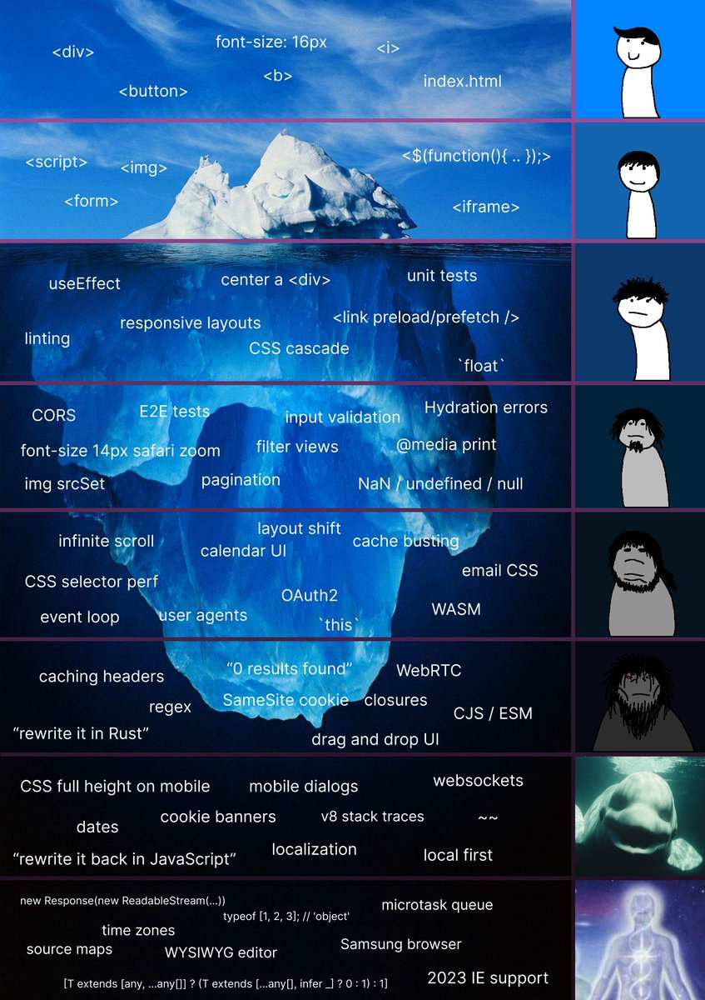

# Agenda

> ***NOTE:** This agenda is copied from the previous term and needs to be adjusted to this semester. Otherwise, the topics are generally in the correct order.*

> These are my notes on what I plan to teach in each [**upcoming class**](#oct-7).
>
> ###### *... Warn those who are idle ..., encourage the disheartened, help the weak, be patient with everyone.*
>
> > My philosophy of teaching, taken from [the source](https://www.bible.com/bible/111/1TH.5.14.NIV)


----

## Sep-Dec 2024 Schedule

### Sep 4 (W01)

- Course Introduction
- GitHub Account Setup
- Software Setup

### Sep 5

- Workbook Setup
  - [000](./src/000/ReadMe.md)
  - [001](./src/001-StartHere/ReadMe.md)
  - [002](./src/002/ReadMe.md)

----

### Sep 9 (W02)

- Characteristics of JavaScript
  - case-sensitive
  - **not** a type-safe language
  - looks a lot like C#, but has a number of differences
  - string literals can be wrapped in double or single quotes
- The browser's dev tools provides a **console** that is a REPL (Read-Eval-Print-Loop) environment for JavaScript
- Node also provides/is a REPL for JavaScript
- [003](./src/003/ReadMe.md)
- **Homework:**
  - [x] Complete the 003/practice


### Sep 11

- [x] Practice Lab (See Brightspace)
- [x] Today's Lesson(s)
  - Complete [004](./src/004/ReadMe.md) (and review [its LOGs](./src/004/LOGs.md))
    - HTML & Emmet in VS Code
    - Link a JavaScript file
  - Begin [005](./src/005/ReadMe.md)
    - Review [its LOGs](./src/005/LOGs.md)

### Sep 12

- [x] Lab 1 released/due **today**
- [x] Today's Lesson(s)
  - Notice the `LOGs.md` files under each lesson - pay attention to these
  - Quick review on yesterday's code: What are *keywords* and what are *not* keywords.
  - What are *functions* in JavaScript?
  - [006](./src/006/ReadMe.md) intro

----

### Sep 16 (W03)

- [ ] Solution to In-Class Lab 1
- [ ] Today's Lesson(s)
  - [**006**](./src/006/ReadMe.md) (cont.) - Intro to Functions in JavaScript
    - Review [its LOGs](./src/006/LOGs.md)
  - [**007**](./src/007/ReadMe.md) - Creating JavaScript Functions
    - Review [its LOGs](./src/007/LOGs.md)

### Sep 18

> Take some time looking over the housekeeping tasks before beginning the lesson on Form Input and Handling Events

- [ ] Housekeeping Tasks:
  - [ ] Version Control: Updating Your Workbook (commit & push)
  - [ ] Filling the Gaps: Self-study is the only way to fill in the gaps between what you do and don't know about HTML.



- [ ] Today's Lesson(s)
  - [**008**](./src/008/ReadMe.md) - Form Input and Handling Events
    - Review [its LOGs](./src/008/LOGs.md)
    - <details><summary>Use the [demo-events](./src/008/demo-events/) as a starter</summary> *(and pull the solution from [this file](backlog\(sort-queue)\w03-events_default_behaviour\js\main.js))*</details>
      - Demo creating an event handler
      - Demo adding an event listener
      - Demo **mouse** events such as `click`, `dblclick`, `mouseenter`, `mouseleave`, `mousemove`
      - Demo adding and removing CSS classes programmatically (from `.classList`)
      - Demo an anonymous handler for an event listener
- [ ] **Homework:** Review the [Learn by Play](./src/005/ReadMe.md#learn-by-play) from [005](./src/005/ReadMe.md).

> To grab a starting point for the demo, you can use [**tiged**](https://github.com/tiged/tiged) (based on [`degit`](https://github.com/Rich-Harris/degit) by Rich Harris, creator of Svelte) to grab a copy of the demo folder from my workbook. Note that you will need to have `pnpm` installed and working on your computer. Run the following code in the terminal from the **root** of your repository:
>
> ```bash
> pnpm dlx tiged --disable-cache --force CPSC-1520/CPSC-1520-Workbook-A02-dgilleland-2024-Sep/src/008/demo-events ./src/008/demo-events
> ```
>
> ***Note:** You may need to <kbd>ctrl</kbd>+<kbd>c</kbd> to stop the `pnpm tlx tiged` command after it has finished downloading the demo folder.*

### Sep 19

- [ ] Lab 2 released/due **today**
- [ ] Today's Lesson(s)
  - Continue [**008**](./src/008/ReadMe.md) - Form Input and Handling Events
  - Explore the [*Text Manipulation*](./src/008/demo-text-manipulation/ReadMe.md) demo

    ```ps
    pnpm dlx tiged --disable-cache --force CPSC-1520/CPSC-1520-Workbook-A02-dgilleland-2024-Sep/sk/008/demo-text-manipulation ./src/008/demo-text-manipulation
    ```

----

### Sep 23 (W04)

- [ ] Today's Lesson
  - [ ] Continue with 008 and explore form processing
    - `.preventDefault()`
    - getting the form's input controls
    - Explore the [*Form Processing*](./src/008/form-processing/ReadMe.md) demo

    ```ps
    pnpm dlx tiged --disable-cache --force CPSC-1520/CPSC-1520-Workbook-A02-dgilleland-2024-Sep/sk/008/form-processing ./src/008/form-processing
    ```

- [ ] **Practice:** Work on the following *self-study* lessons:
  - [ ] [~~009~~ *Original link in lesson is out-of-date*](./src/009/ReadMe.md) - Waiting for the DOM
  - [ ] [010](./src/010/ReadMe.md) - Debugging
  - [ ] [011](./src/011/ReadMe.md) - Organizing Functions

### Sep 25

- [ ] Today's Lesson
  - [ ] [012](./src/012/ReadMe.md) If/Else statements
  - [ ] [013](./src/013/ReadMe.md) Form Validation

    ```ps
    pnpm dlx tiged --disable-cache --force CPSC-1520/CPSC-1520-Workbook-A02-dgilleland-2024-Sep/sk/013 ./src/013
    ```

### Sep 26

- [ ] Lab 3 released/due **today**
- [ ] Today's Lesson
  - [ ] *Complete any parts to this point that are not finished.*
    - [ ] Default and explicit values for `<input type='checkbox'>` and `<input type='radio'>`
    - [ ] Radio Button Groups and Checkbox Groups all share the same `name` attribute value

----

### Sep 30 (W05)

- ***No Classes***

### Oct 2

- [ ] Today's Lesson - [Form Processing 2](./src/013/form-processing-2/ReadMe.md)
  - [ ] *Complete any parts to this point that are not finished.*
  - [ ] JavaScript [`switch` statement](https://developer.mozilla.org/en-US/docs/Web/JavaScript/Reference/Statements/switch).
- [ ] ***Homework***
  - [ ] **Shipping Calculator** - Practice
    - Create the code to perform the calculations for the [Shipping Calculator](./shipping-calculator/Readme.md) sample.
  - [ ] Replicate the demo below in your student workbook. Place it in its own folder under the `~/src/013/` topic folder.
    - Use decisions in form validation
      - Use [this sample](https://chat.openai.com/share/7f9ac87e-8778-43b0-b9b8-dc1c4e8fe8a7)

### Oct 3

- [ ] In-Class Lab 4 - Forms and Validation
  - *Intro to the In-Class Lab 4*
- [ ] Announce **Assignment 1** (week-long) assignment released on Oct 4 (see Brightspace)
- [ ] Today's Lesson
  - [ ] [015](./src/015/ReadMe.md) - Intro to Arrays & Loops

    ```ps
    pnpm dlx tiged --disable-cache --force CPSC-1520/CPSC-1520-Workbook-A02-dgilleland-2024-Sep/sk/015 ./src/015
    ```

  - [ ] *Rabbit Trail:* Went off on a journey to explore using functions as parameters/callbacks in other functions

----

### Oct 7


- [ ] Review Assignment 1 lab specs
  - [ ] Lab Time

### Oct 9 *(Online)*

- [ ] Another Array Demo
  - [ ] Note the benefits of Array Processing for `.querySelectorAll()` results
  - [ ] [016](./src/016/ReadMe.md) Intro to Arrays (with a little extra on "keyboard navigation")

    ```ps
    pnpm dlx tiged --disable-cache --force CPSC-1520/CPSC-1520-Workbook-A02-dgilleland-2024-Sep/sk/016 ./src/016
    ```
  
  - [ ] [017](./src/017/ReadMe.md) *Self-study of "Addendum" portion*

    ```ps
    pnpm dlx tiged --disable-cache --force CPSC-1520/CPSC-1520-Workbook-A02-dgilleland-2024-Sep/sk/017 ./src/017
    ```
  

### Oct 10

- [ ] In-Class Lab 5 - Arrays and Loops (*with addendum instructions*)
<!--
  - > *Addendum:*
    - Modify the “images” array with the image names only ~~(including the path)~~ in the images folder
    - The instructions for *Step 2: Add To My Images* are a little backwards. Read carefully to get the *actual intent* of the instructions (which is to *not* have duplicates in the rendering of saved images). There is an "unspoken" intent for `renderImageList` to "clear out" the inner HTML of the `savedList` DOM element.
    - In *Step 3*, `renderImageList` is mistakenly referred to as `renderMyImageList`.
-->
  - Lab Time

----

### Oct 14

- ***No Classes***

### Oct 16 *(Online)*

- [ ] Today's Lesson
  - [ ] [018](./src/018/ReadMe.md) Intro to JavaScript Objects (in their various forms)
    - [ ] Object Literals

    ```ps
    pnpm dlx tiged --disable-cache --force CPSC-1520/CPSC-1520-Workbook-A02-dgilleland-2024-Sep/sk/018 ./src/018
    ```

### Oct 17
  
- [ ] More on JavaScript objects (primarily in the Node terminal)
  - [ ] [Object Literals and `get`/`set` methods](https://developer.mozilla.org/en-US/docs/Web/JavaScript/Guide/Working_with_Objects#defining_getters_and_setters)
  - [ ] [Creating Objects using Constructor Functions](https://developer.mozilla.org/en-US/docs/Web/JavaScript/Guide/Working_with_Objects#using_a_constructor_function)
  - [ ] **Prototypical Inheritance in JS:** [Adding Properties to Existing Objects through the Prototype](https://developer.mozilla.org/en-US/docs/Web/JavaScript/Guide/Working_with_Objects#inheritance)
- [ ] **Homework:**
  - [ ] Read about the [`this`](https://developer.mozilla.org/en-US/docs/Web/JavaScript/Guide/Working_with_Objects#using_this_for_object_references) keyword to understand its relationship to objects in JavaScript
  - [ ] Read about [comparing objects](https://developer.mozilla.org/en-US/docs/Web/JavaScript/Guide/Working_with_Objects#comparing_objects) to appreciate how objects in JavaScript are reference types

----

### Oct 21

- [ ] Today's Lesson
  - [ ] [019](./src/019/ReadMe.md) Assorted Topics

    ```ps
    pnpm dlx tiged --disable-cache --force CPSC-1520/CPSC-1520-Workbook-A02-dgilleland-2024-Sep/sk/019 ./src/019
    ```
  
    - [ ] JSON and JavaScript Objects
      - [ ] Explore via the `node` environment in the terminal
      - [ ] A note on the `fs` module in Node
    - [ ] Intro to the Fetch API
      - [ ] Web APIs and JSON responses
      - [ ] What is the Fetch API?
    - [ ] A word on [Arrow Functions](./src/019/ReadMe.md#arrow-functions)
    - [ ] A quick-n-plain Node package using `vite`
      - [ ] Why we need a Web Server for `fetch`


----

----

## TENTATIVE SCHEDULE


----

<!--
### Jan 22 (W03)

- [x] Here's another learning resource: https://javascript.info/
- [ ] Release Lab 2

### Jan 24

- [ ] *Work Period*

### Jan 26

- [ ] Today's Lesson
  - [**012**](./src/012/ReadMe.md) - Making Decisions
    - Review [its LOGs](./src/012/LOGs.md)
    - Nesting If-Else statements (using the [grammar demo](./src/012/demo-grammar/))
    - Use decisions in form validation
      - Use [this sample](https://chat.openai.com/share/7f9ac87e-8778-43b0-b9b8-dc1c4e8fe8a7)
  - [**013**](./src/013/ReadMe.md) Forms

    ```bash
    pnpm dlx tiged --disable-cache --force CPSC-1520/cpsc-1520-workbook-jan2024-a03-dgilleland/src/013 ./src/013
    ```

    - Also check out this on [Learning Web Forms](https://web.dev/learn/forms/)
- **Homework:**
  - [**009**](./src/009/ReadMe.md) - Waiting for the DOM

    ```bash
    pnpm dlx tiged --disable-cache --force CPSC-1520/cpsc-1520-workbook-jan2024-a03-dgilleland/src/009 ./src/009
    ```

  - [**010**](./src/010/ReadMe.md) - Debugging JavaScript

    ```bash
    pnpm dlx tiged --disable-cache --force CPSC-1520/cpsc-1520-workbook-jan2024-a03-dgilleland/src/010 ./src/010
    ```

  - [**011**](./src/011/ReadMe.md) - Organizing Functions in JavaScript

    ```bash
    pnpm dlx tiged --disable-cache --force CPSC-1520/cpsc-1520-workbook-jan2024-a03-dgilleland/src/011 ./src/011
    ```

----

### Jan 29 (W04)

- [ ] In-Class Lab 3

### Jan 31

- [ ] [Shipping Calculator](./src/013/shipping-calculator/Readme.md)

### Feb 2

- [ ] In-Class Lab 4
  - *Intro to the In-Class Lab 4*

----

### Feb 5 (W05)

- [ ] Solution to Lab 4
- [ ] [015](./src/015/ReadMe.md) Intro to Loops

    ```bash
    pnpm dlx tiged --disable-cache --force CPSC-1520/cpsc-1520-workbook-jan2024-a03-dgilleland/src/015 ./src/015
    ```


### Feb 7


    ```bash
    pnpm dlx tiged --disable-cache --force CPSC-1520/cpsc-1520-workbook-jan2024-a03-dgilleland/src/016 ./src/016
    ```

----


### Feb 26

    ```bash
    pnpm dlx tiged --disable-cache --force CPSC-1520/cpsc-1520-workbook-jan2024-a03-dgilleland/src/018 ./dan/018
    ```

### Feb 28

- [ ] In-Class 5

----

### Mar 1

----

### Mar 5

```bash
pnpm dlx tiged --disable-cache --force CPSC-1520/cpsc-1520-workbook-jan2024-a03-dgilleland/src/019 ./src/019
```

-->

### Mar 6

- [ ] Continue exploring Fetch API, but within a Node project

### Mar 8

- [ ] Another Fetch API example consuming data from RandomUser.me; this ad-hoc example is found under the [sandbox/UserProfile/](./sandbox/UserProfile/ReadMe.md) folder.
  - [ ] Consume JSON data from [RandomUser.md](https://randomuser.me)
  - [ ] Render information in the DOM through template strings with placeholders for content
  - [ ] Today's demo is also recorded and available in MS Teams under the *Files* tab; navigate to `Recordings>View Only` and look for the one on this date (March 8).

----

### Mar 11

- [ ] Continue the [User Profile](./sandbox/UserProfile/ReadMe.md) example. In this example, we'll attempt to
  - [ ] Integrate additional Node packages (in this case, Leaflet.js, to render a map)
  - [ ] **DOM API** to create elements and text nodes and to change properties of created elements; these dynamic elements are then added to the DOM so that they are rendered in the page

### Mar 13

- [ ] Continue the [User Profile](./sandbox/UserProfile/ReadMe.md) example. In this example, we'll attempt to
  - [ ] Short demo of using `data-*` attributes on DOM elements as a means of retaining metadata for use in your JavaScript code.

### Mar 15

- [ ] Free lab period

----

### Mar 18

```bash
pnpm dlx tiged --disable-cache --force CPSC-1520/cpsc-1520-workbook-jan2024-a03-dgilleland/src/024 ./src/024
```

- [ ] Timeouts and Intervals in JavaScript - [024](./src/024/ReadMe.md)
  - [ ] What are Timeouts?
  - [ ] What are Intervals?
  - [ ] How to start Timeouts/Intervals?
  - [ ] How to stop Timeouts/Intervals?
  - [ ] StopWatch 2.0 is kinda good
- [ ] [DOM API Demo/Practice](./src/025/ReadMe.md)

```bash
pnpm dlx tiged --disable-cache --force CPSC-1520/cpsc-1520-workbook-jan2024-a03-dgilleland/src/025 ./src/025
```

### Mar 20

- [ ] **Review Class: Open Questions**
  - [ ] This class will be dedicated to answering questions about JavaScript material covered so far in the course.

### Mar 22

- [ ] **In-Class 6** - Fetch API
- [ ] Assessment 2 (Take-Home Lab) released (due on **Mar 29**)

----

### Mar 25

- [ ] A bit more on Node-based project
- [ ] Lab time to work on Assessment 2

### Mar 27

- [ ] A bit more on Node-based project
- [ ] Lab time to work on Assessment 2

### Mar 29

- [ ] **Quiz 4** on Moodle closes
- [ ] Lab time to work on Assessment 2
- [ ] **Assessment 2 Due Today**

----

### Apr 1

- [ ] Classes in JavaScript


### Apr 3

- [ ] Node Project - `parcel`


### Apr 5

- [ ] **In-Class 7** - Node Projects
- [ ] *TBD*


----

### Apr 8

- [ ] JavaScript Classes and Prototypes
- [ ] Vitest


### Apr 10

- [ ] *TBD*


### Apr 12

- [ ] **Quiz 5** on Moodle closes
- [ ] *TBD*

----

### Apr 15

- [ ] *TBD*


### Apr 17

- [ ] *TBD*


### Apr 19

- [ ] *TBD*


----

### Apr 22

- [ ] *TBD*


### Apr 24

- [ ] **In-Class 8** - 
- [ ] **Assessment 3 Due Today**


### Apr 26

- [ ] *Final day of classes*
- [ ] **Quiz 6** on Moodle closes


### Future

