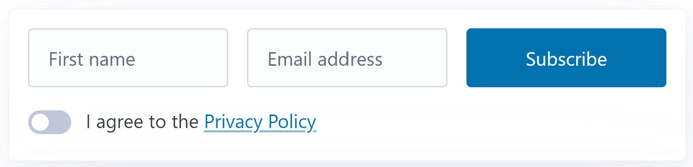
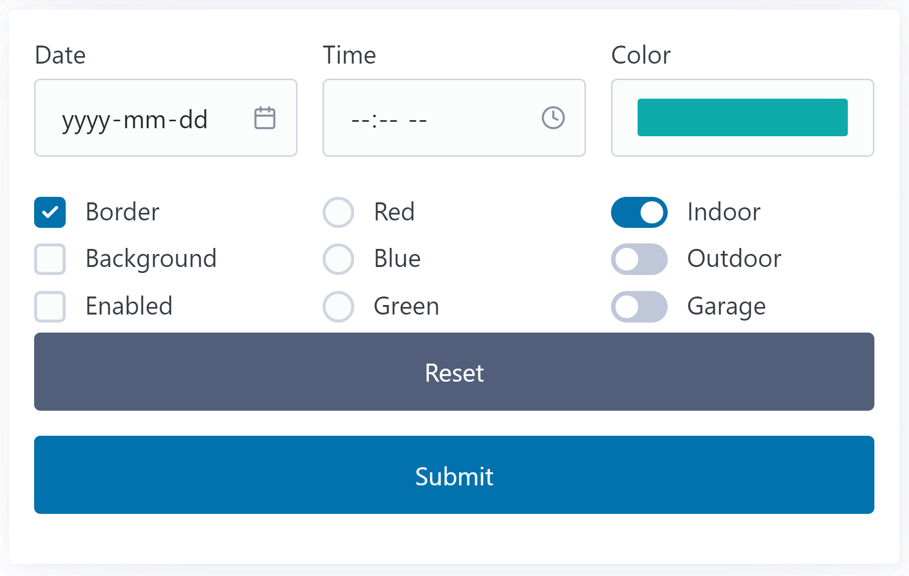

# Form Processing - Revisited

This version of *Form Processing* from the original is your opportunity to add validation to the user's input for a couple of forms.

## Subscribe Form

The `'subscribe'` form contains three controls - `firstname`, `email` and `terms` - which are a textbox, email input and checkbox respectively. Part of what makes this form different from the second is that the `firstname` and `email` inputs use a *`required`* attribute, meaning that the form's submit button will not generate the `'submit'` event unless there is text inside (even if it's just empty spaces).

Apply the following validations to the user's input, and display appropriate messages in the `id='feedback'` element.

- [ ] `firstname` must be at least 2 characters and cannot have any spaces
- [ ] `email` must be from an "approved" domain: `@nait.ca`, `@gmail.com` or `@gov.ab.ca`
- [ ] `terms` must be checked on

## Assorted Form

The `'assorted'` form contains several sets of controls.

- A `date`, `time` and `color` input (whose `name` values are the same as the input type).
- Three checkboxes, all with the name `feature` but with different values: `border`, `background` and `button enabled`.
- Three radio buttons, all with the name `bg-color` but with different values: `#ff0000`, `#00ff00` and `#0000ff`.
- Three distinct checkboxes with the names `indoorCamera`, `outdoorCamera` and `garageCamera`. No explicit `value` is assigned to these checkboxes.

Validation will always be situation-specific. Examine the user's input to determine the following:

- [ ] Identify which of the first three inputs were not supplied by the user (date, time, color).
- [ ] The selected color cannot be black or white.
- [ ] Determine if the checkboxs for features are all on or all off.
- [ ] Determine if any of the cameras have been selected/turned on.

We'll also apply the `bg-color` value to the border color of the `<code>` tag containing our feedback to the user.

## `switch` Statements

> Details on the [`switch` statement](https://developer.mozilla.org/en-US/docs/Web/JavaScript/Reference/Statements/switch) can be found in the MDN docs.

- [ ] If one of the radio buttons for base colors (red, green, blue) is present in the value from the color-picker by 50% or more (i.e. - greater than `#77), indicate that the color is strongly present in the selected color.
