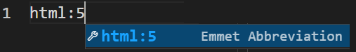

# JavaScript in Your WebPage

The following is a short-list of the topics covered in this demo.

- console.log
- `<script ...>` attributes of `src`, `module` and `defer`, along with "inline" scripts
- live server extension for VS Code
- variable declarations, types, math

----

## Discover Emmet  

This walkthrough introduces **Emmet**. It also contains two small JavaScript files: [`first.js`](./first.js) and [`second.js`](./second.js). Here, we will explore the effect of including these in the `<head>` of an HTML document that we will generate using *Emmet*.

Loading external JavaScript files is accomplished through the `<script>` element's `src` attribute. JavaScript code can be included in the HTML directly by being placed in the `<script>` element directly, but larger scripts are typically kept separate from the HTML in their own files. They standard file extension for JavaScript files is `.js`.

1. Create an `Index.html` file in this folder. Add a basic html document using [Emmet](https://code.visualstudio.com/docs/editor/emmet) by typing `html:5` and selecting the Emmet-generated expansion.

   

1. Add some basic content to the page using Emmet:

    ```
    h1{Emmet for HTML/JS/CSS}+ul>li{Item $}*3^p*3>lorem
    ```

1. In the `<head>` element of the page, add the following markup.

    ```html
    <script src="first.js"></script>
    <script src="second.js" type="module" defer></script>
    ```

1. View the page in the browser by launching it using Live Server. Right-click on the file and choose "Open with Live Server".

    

> *:+1: **TIP:** It's usually a good idea to use relative paths when linking your HTML to JavaScript files. This makes it easier to move sets of files around without having to change the internal code.*

## Use a Vite Server

Every website needs a web server in order for people to view the pages. When we used the *Live Server* extension in VS Code, that acted as our web server. The problem, however, is that Live Server treats the *root of the repository* as the root of the website. We can do something better than that by creating our example as its own **Web Project** using [**Vite**](https://vitejs.dev/).

1. If you are still viewing your page using Live Server, stop the server by clicking the appropriate part of the VS Code status bar.
1. In the terminal, navigate to the folder holding your `index.html` file.
1. Create a  **project** by typing `pnpm init` in the terminal. This will create a `package.json` file. Take a few moments to look over that file and see what it contains.
1. Add a development dependency to [**Vite**](https://vitejs.dev/) by typing `pnpm i -D vite` in the terminal. This will modify the `package.json` file to reference Vite as a third-party solution. It will also set up a `node_modules` folder where all your third-party packages will reside.
1. Modify your `package.json` by adding a script entry to run the Vite server. It's only **one line** that you are adding to your `package.json`.

    ```json
    "scripts": {
        "dev": "vite",
        "test": "echo \"Error: no test specified\" && exit 1"
    },
    ```

1. In the terminal, enter `pnpm run dev` (or just `pnpm dev`). This will launch Vite as your web server. While in the terminal, press `o` and hit <kbd>enter</kbd>. This will open the page in the browser.


----

## Software Design 

"Tight coupling" makes for bad design, because changes in either area can potentially "break" the other areas. 

"Loose coupling" between the areas of Content, Presentation, and Functionality makes for a flexible design that is easy to maintain.

| Tight Coupling | Loose Coupling |
|:--------------:|:--------------:|
|  |  |


This is not to say that content, presentation and functionality have no reference to each other. It's just that we want the connections between them to be ["unobtrusive"](https://dictionary.cambridge.org/dictionary/english/unobtrusive). In the case of web pages, it's the browser's job to bring together HTML, CSS and JavaScript files; this happens in the rendering process for the page.


----

## References

- [**Emmet**](https://emmet.io/)
  - [Documentation](https://docs.emmet.io/)
  - [Emmet CheatSheet](https://docs.emmet.io/cheat-sheet/)
- [The `<script>` Element](https://developer.mozilla.org/en-US/docs/Web/HTML/Element/script)
