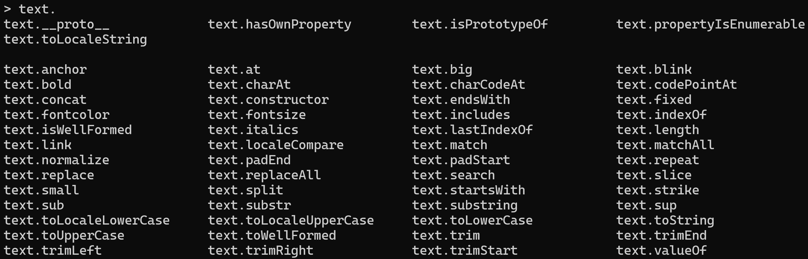
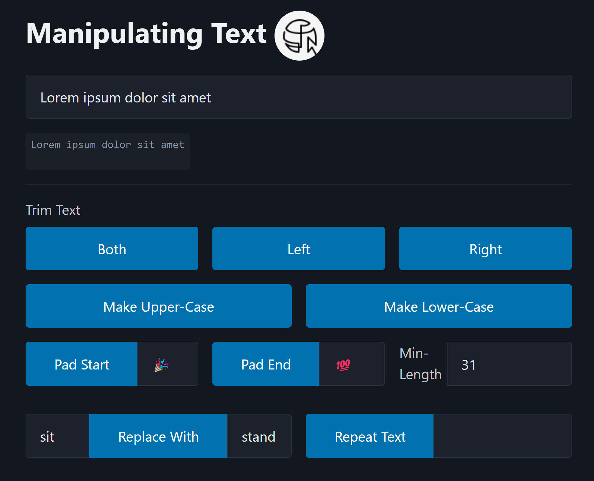

# Text Manipulations

The focus of this example is to

- Explore the functions built into the `string` type in JavaScript
- Create event handlers for user interactions
- Manipulate DOM values

## Exploring `string` functions

Use the `node` REPL to explore the various string functions to see how they work. Open a terminal window on your computer and type `node` to enter into the REPL environment. Then, create a string variable: `let text = 'Something';`. Lastly, begin typing `text.` and immediately after the dot operator press the <kbd>tab</kbd> key twice. You should see a list of the various public members of your string object.

----

## The Web Page

A number of buttons and input fields have been placed on this page to allow the user to perform string manipulations. Here are the `id` values for the various controls.

- `<input id="userInput">` - Where the user can enter some text to be manipulated.
- `<pre id="transformedText">` - The output of the transformed text.
- **Trimming** - Three buttons with the `id` values of `transformTrim`, `transformTrimLeft` and `transformTrimRight`
- **Changing Case** - Two buttons with the `id` values of `transformToUpperCase` and `transformToLowerCase`
- **Padding Text** - The button ids are `transformPadStart` and `transformPadEnd` with corresponding inputs of `startText` and `endText` along with a numeric input identified as `minLength`
- **Replace Text** - The `transformReplace` button is intended to find the `replaceThis` value in the user's input and substitute it with the `replaceWith` value.
- **Repeating Text** - The `transformRepeat` is to have the user's input repeat itself by the number of times indicated in `repeatText`

### Pratice

Expand on the web page by adding buttons to the HTML to demonstrate the effects of calling functions such as `.bold()`, `.italics()`, `.link('https://developer.mozilla.org')`, `.small()`, `.sub()` and `.sup()`. Further explore these string methods by adding a `
` beneath the `<code>` block and changing its content using the `.innerHTML` property. 