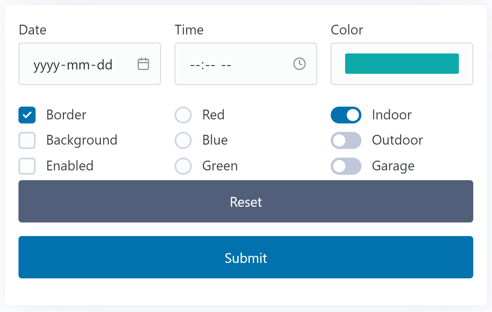

# Form Processing

**HTML forms** are the traditional way to capture user input and perform the types of tasks that make a website *useful* or *interactive* &mdash; it's how we build web *applications*. The caveat that we have to acknowledge with HTML forms is that we almost always do our most meaningful processing through a ***server response*** to the form's request.

In this course, we're dealing exclusively with *client-side* JavaScript, so our usage of HTML forms is somewhat artificial. This is especially true in how we will regularly be using the `.preventDefault()` method on the `'submit'` event object to prevent the form from posting a request to the web server. With that being said, let's explore form processing in the browser using JavaScript.

## Basic Form Structures

HTML can accommodate multiple forms on a single page, but it's important that those forms are not *nested* one within another. The `<form>` element is typically accompanied with a `method` attribute (with a value of `POST` or `GET`) and an `action` attribute (which identifies the server resource or URL that the *request* is directed towards). These attributes have been omitted because we will only be performing client-side processing.

This sample uses a couple of forms as small "islands" of sample form processing. The first form has the id `'subscribe'` and the second has the id `'assorted'`. In this demo, we will create separate event handlers for each form's `'submit'` event. 

### Subscribe Form

The `'subscribe'` form contains three controls - `firstname`, `email` and `terms` - which are a textbox, email input and checkbox respectively. Part of what makes this form different from the second is that the `firstname` and `email` inputs use a *`required`* attribute, meaning that the form's submit button will not generate the `'submit'` event unless there is text inside (even if it's just empty spaces).

### Assorted Form

The `'assorted'` form contains several sets of controls.

- A `date`, `time` and `color` input (whose `name` values are the same as the input type).
- Three checkboxes, all with the name `feature` but with different values: `border`, `background` and `button enabled`.
- Three radio buttons, all with the name `bg-color` but with different values: `#ff0000`, `#00ff00` and `#0000ff`.
- Three distinct checkboxes with the names `indoorCamera`, `outdoorCamera` and `garageCamera`. No explicit `value` is assigned to these checkboxes.

### Form Processing

Create a separate event handler for each of these forms that will respond to the `'submit'` event. Output the values of the various input controls in the `<pre id='feedback'>` element.

----

> ***Note:** With modern HTML/CSS, there are many aspects of form processing that no longer needs to be handled by JavaScript exclusively. Specifically, **simple form validation** is something that CSS and HTML can work together to perform quite cleanly. However, complex client-side validation is still quite firmly in the camp of requiring JavaScript.*