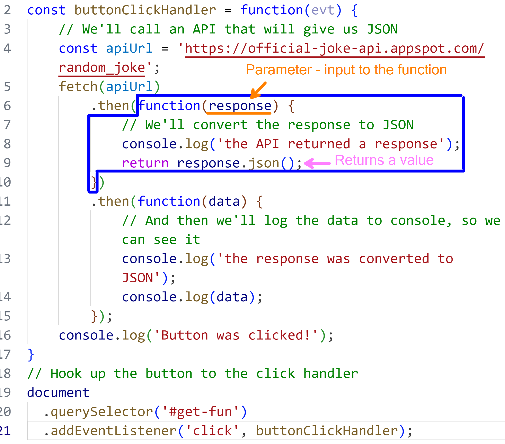
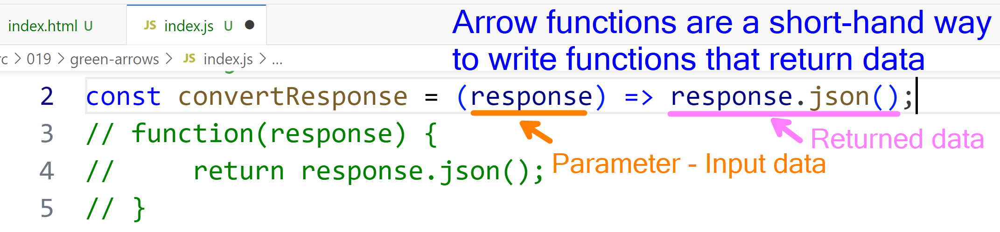

# Building On JSON

> When learning JSON, there are some other *background* items that pop up, such as [**Arrow Functions**](#arrow-functions), **JavaScript Promises** and **Async/Await**.

## Lesson Notes

### Part 1

- [ ] [JSON Intro](./jsonIntroScript.js) - A "walk-with-me" demo in the Node REPL to learn about JSON.
- [ ] [Bedrock High School](./bedrockHighSchool.json) - A demo of a `.json` file
- [ ] [Green Arrows](./green-arrows/index.js) - A demo about Arrow Function syntax in JavaScript and using the **Fetch API** (handling the promise with `.then()` fluent function calls). *JS Modules*
- [ ] [JSON Demo](./json-demo/index.js) - Demo of using `JSON.parse()` and `JSON.stringify()` to help illustrate the differences between JavaScript objects and JSON. Also loads up a `friends.json` file using the **Fetch API** (again, with `.then()` functions, but also with the **`await`** keyword). *JS Modules*
  - [ ] **NOTE** how the Fetch API receives the JSON data *as a string* (the first `T` in `HTTP`) and that we need to *parse* the results.
- [ ] **Homework** - Open a Note REPL and experiment with the [Random User API](./DemoRandomUserApi.js)

### Part 2

- [ ] [Node Project Basics](./node-plain/package.json) - A sample `package.json` created by initiating a Node project.
  - [ ] Create a folder called `node-practice` and open the terminal in that folder. Then run `pnpm init` and see what happens
- [ ] [Node Vite](./node-vite/ReadMe.md) - A sample of a Node project using [**Vite**]() as the "engine" for development and building.
  - [ ] Follow the instructions from the [Node Vite ReadMe](./node-vite/ReadMe.md) in a **different** folder under this lesson for hands-on experience in setting things up.
  - [ ] Turn the *Green Arrows* and *JSON Demo* demos into Node projects that can be run with Vite

### Arrow Functions

| Before Refactoring | After Refactoring |
| --- | --- |
| ```function (x) { return x * x; }``` | ```x => x * x``` |
| ```function (x, y) { return x * y; }``` | ```(x, y) => x * y``` |
| ```function () { return 42; }``` | ```() => 42``` |
| ```function (x) { return { value: x }; }``` | ```x => ({ value: x })``` |
|  |  |

----

## Above and Beyond

- [ ] Discuss JSONC (and note the [support in VS Code](https://code.visualstudio.com/Docs/languages/json#_json-with-comments); see also [this article](https://www.techiediaries.com/enable-json-comments-vs-code/)) and [JSON5](https://json5.org/); review points of [**this article**](https://tuantran92.id.vn/comparison-of-json-and-json5/) 
- [ ] Discuss [JSONL](https://jsonlines.org/) and review [**this article**](https://www.atatus.com/glossary/jsonl/)
