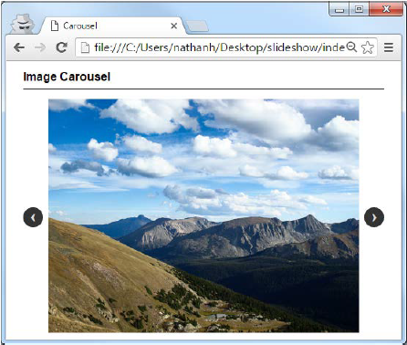

# Dates, Timers, Intervals 

## Readings

- [Date](https://developer.mozilla.org/en-US/docs/Web/JavaScript/Reference/Global_Objects/Date)
- JavaScript Timers
  - [`setTimeout`](https://developer.mozilla.org/en-US/docs/Web/API/setTimeout)
  - [`setInterval`](https://developer.mozilla.org/en-US/docs/Web/API/setInterval)
- [JavaScript Ternary Operator](https://developer.mozilla.org/en-US/docs/Web/JavaScript/Reference/Operators/Conditional_Operator) -

----

## Timely Demo

Learn a bit about the Date object in JavaScript with the [Timely Demo](./demos/Timely/).

> ***Customizations:***
>
> - Made this a node project with `pnpm init` (creates the `package.json` file)
> - Use the vite library as my development server `pnpm add -D vite` (add in the library)
> - Modify the `package.json` to include a new script: `"dev": "vite",`
> - Launch the dev server with `pnpm dev` and then type <kbd>o</kbd> + <kbd>[enter]</kbd>

----

## Exploring Timeouts

In the [Exploring Timeouts](./demos/ExploringTimeouts/) demo, you are prompted to enter the secret password and then you are given access. But wait! If you enter the wrong password, then a timer is set for 8 seconds to prompt you once more for the password. If you enter the wrong password again, then the process repeats. But don't worry, you can either enter the correct password, or just click the "Stop Nagging" button.

----

## Exploring Intervals

The [Exploring Intervals](./demos/ExploringIntervals/) demo keeps placing dots on the screen every second. This is done with the `setInterval()` function in JavaScript. There is a button to stop the interval.


## Stop-Watch

This short demo is an implementation of an [older] MDN article on using the `setInterval()` function.

It is incomplete, but does have instructions in the comments of [`main.js`](./demos/StopWatch/main.js) on what to do to complete this.

## Stop-Watch 2.0

This is a *much* better demo of a stop watch that is in the [StopWatch2.0](./demos/StopWatch2.0/) directory.

----

## Practice - Working with Timers

> This exercise is in the [practice](./practice/) project folder.

There are times when you may need  something to happen on the page without a trigger from the user. Examples include: timed slideshows, rotating site or product reviews, simple animations (e.g. fades and slides), etc. In order to trigger functions automatically, we can take advantage of several functions in the browser's global scope: `setTimeout` and `setInterval`.

To demonstrate how these functions can be used to automate actions on the page, we will revisit the image carousel from the a exercise:

> Figure 1. Image carousel from previous exercise



We will implement a timer for the carousel that will progress onto the next image in the slideshow every 3 seconds.

## Operation of `setTimeOut` and `setInterval`

Each of the two functions mentioned here have identical APIs and only differ in how they operate, with setTimeout only calling a function a single time and setInterval continuing to call the function after the specified amount of time. Both functions are called with the following three parameters:

1. Function to call
2. Time to wait before/between calling the function (specified in milliseconds)
3. A comma separated list of arguments to the called function

Typically you will see only the first two parameters used in these calls to due to the fact that IE (all versions) do not implement the list of arguments.

Once called, each function returns an id, which can then be used to identify the specific context that was created. This is useful as each function has a paired clear function (e.g. clearTimeout) that can be used to cancel the context that was created before the next function call. Examples of creating a timeout context and then cancelling follow.

> Example 1. Using setTimeout to set a onetime call to a function for 3 seconds in the future

```js
var to = setTimeout(someFunction,3000);
```

> Example 2. Using the paired function clearTimeout to cancel the previously created timeout context

```js
clearTimeout(to);
```

Please read more about these timer functions (and their paired clear functions) [here](https://developer.mozilla.org/en/docs/Web/API/NodeList#Why_is_NodeList_not_an_Array).

Automating the Slideshow In order for the slideshow to automatically move onto the next image a timer must be initialized. Unlike the example 1 above, we will need to set an interval so that the site continues to progress to a new slide every 3 seconds, and not just once after 3 seconds.

First, a function must be made to do the actual updating of the displayed image. We can create this function so that it can be used in all places where we currently update the current slide:

> Example 3. A function to update the current slide image

```js
function updateSlide(index) {
  // display the new current image
  document.querySelector('.carousel>img').src = 'images/' + images[index];
  // update the active selector bullet
  document.querySelector('.image-tracker .active').classList.remove('active');
  document.querySelectorAll('[data-idx]')[index].classList.add('active');
}
```

Now this function can be used in all places where we are currently updating the displayed image:

> Example 4. Update the existing code to use the updateSlide function

```js
// replace lines 35-40 with the following call
updateSlide(currentImg);
```

Now all that's left is to setup the interval to call the updateSlide function every 3 seconds. Because we cannot rely on the setInterval's third parameter (i.e. the argument list), we will have to use an anonymous function in the call to setInterval that can update the current image and make the call:

> Example 5. Making the final call to setInterval

```js
// add a variable to track the context of the interval
var slideshowInterval;
...
// now call the setInterval function to begin the slideshow
slideshowInterval = setInterval(function () {
  currentImg += 1;
  if (currentImg == images.length) {
    currentImg = 0;
  }
  updateSlide(currentImg);
}, 3000);
```

That's it! Reload the page and your slideshow should move along every 3 seconds.
